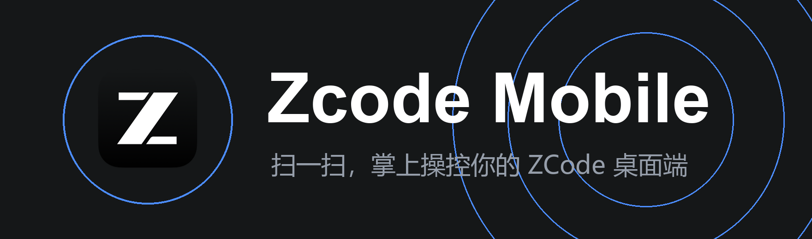
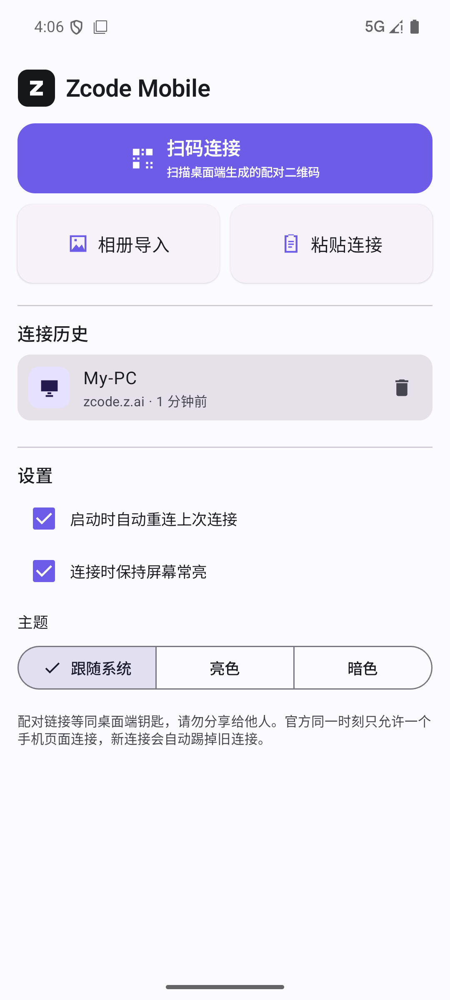
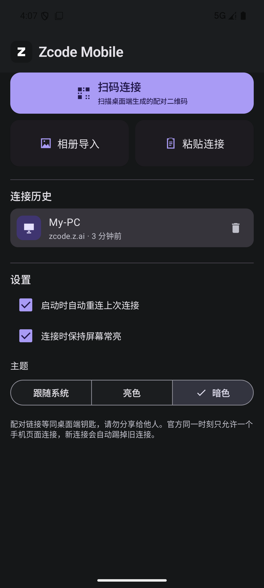

<div align="center">



# Zcode Mobile

**非官方的 ZCode 桌面端移动连接客户端（Android）**

<a href="#"></a>
<a href="#"></a>
<a href="#"></a>
<a href="#"></a>
<a href="https://zcode.z.ai"></a>
<a href="#"></a>

[亮点](#-亮点) · [界面预览](#-界面预览) · [工作原理](#%EF%B8%8F-工作原理) · [快速开始](#-快速开始) · [构建](#-从源码构建) · [常见问题](#-常见问题)

`扫码 / 相册导入 / 粘贴` `连接历史与自动重连` `无自建后端` `配对 URL 只存本机`

</div>

---

**Zcode Mobile** 解决的是一个小痛点：ZCode 桌面端的「移动端远程控制」每次都要掏出手机扫码。本应用把扫码、相册导入、粘贴三种连接方式装进一个原生安卓壳里，配对一次即自动记住，之后打开 App 直接回到远程控制页面——手机上获得与官方移动页面完全一致的操控能力。

> 本项目是**壳**：连接、配对、加密转发全部由 ZCode 官方云端页面（`zcode.z.ai/remote/v4`）完成，App 不实现任何私有协议，也没有自建后端。

## 目录

- [亮点](#-亮点)
- [界面预览](#-界面预览)
- [工作原理](#%EF%B8%8F-工作原理)
- [快速开始](#-快速开始)
- [从源码构建](#-从源码构建)
- [仓库结构](#-仓库结构)
- [常见问题](#-常见问题)
- [免责声明](#-免责声明)

## 🌟 亮点

- 📷 **三种连接方式** — 相机扫码（ML Kit 实时识别）、**相册导入二维码**（截图桌面端二维码即可，无需第二台手机）、粘贴连接地址。
- 🔁 **一次配对，长期直连** — 连接历史按最近使用排序，启动时自动重连上次连接，日常使用零扫码。
- 📱 **官方同源体验** — 全屏 WebView 打开官方云端控制页，官方页面怎么升级，App 就跟着升级，不需要更新客户端。
- 🌗 **亮 / 暗 / 跟随系统** 三套主题，连接时可选屏幕常亮。
- 🔒 **本地与私密** — 无账号、无统计、无第三方后端；配对 URL（等同桌面端钥匙）只存应用私有目录。
- 🪶 **轻量** — 单 Activity + Compose，核心代码不到两千行。

## 📱 界面预览

| 亮色 | 暗色 |
|:---:|:---:|
|  |  |

*连接历史卡片、扫码 / 相册 / 粘贴三入口、主题与常亮设置。*

## ⚙️ 工作原理

ZCode 桌面端「移动端远程控制」的二维码内容是一个云端托管页面地址：

```
https://zcode.z.ai/remote/v4?sid=<设备ID>&hash=<口令哈希>&t=<时间戳>&mid=<机器ID>&name=<主机名>&app_version=<版本>
```

桌面端主动外连云端中继 `wss://zcode.z.ai/ws`，本机不监听任何端口；手机页面与桌面端之间的配对握手（HMAC-SHA256 证明）与加密转发全部由官方页面和中继完成。本 App 做的事情是：

| 环节 | 实现 |
|------|------|
| 获取连接 | CameraX + ML Kit 扫码 / Photo Picker 相册识别 / 手动粘贴 |
| 校验 | 官方域名白名单、`/remote/v3\|v4` 路径、`sid`/`hash` 配对参数完整性 |
| 连接 | 全屏 WebView 加载该 URL，官方域名内跳转留在应用内，外链交给系统浏览器 |
| 记忆 | DataStore 保存连接历史与设置，按 URL 去重，启动自动重连 |

## 🚀 快速开始

### 方式一：直接安装 APK

1. 下载 [ZcodeMobile-v1.1.0.apk](https://github.com/KirishimaEri/zcode-mobile/releases/download/v1.1.0/ZcodeMobile-v1.1.0.apk)（约 30 MB，需 Android 8.0+）；
2. 传到手机安装，允许「安装未知来源应用」；
3. 桌面端 ZCode 打开左下角「移动端远程控制」弹窗 → App 点「扫码连接」对准二维码。

### 方式二：自行构建

```bash
git clone https://github.com/KirishimaEri/zcode-mobile.git
cd zcode-mobile
./gradlew :app:assembleDebug
# 产物：app/build/outputs/apk/debug/app-debug.apk
```

需要 **JDK 17+** 与 **Android SDK（compileSdk 35）**，`local.properties` 由 Android Studio 自动生成。

## 📂 仓库结构

```
zcode-mobile/
├── app/src/main/java/com/zcodemobile/app/
│   ├── MainActivity.kt        # 单 Activity、页面导航、连接通知
│   ├── QRUrlParser.kt         # 二维码 URL 解析与校验（含单元测试）
│   ├── ConnectionStore.kt     # 连接历史与设置的 DataStore 持久化
│   └── ui/
│       ├── HomeScreen.kt      # 首页：三入口、历史、设置、主题
│       ├── ScannerScreen.kt   # CameraX + ML Kit 实时扫码
│       ├── QrImageDecoder.kt  # 相册图片二维码识别（EXIF 方向校正）
│       ├── WebScreen.kt       # 全屏 WebView 连接页
│       └── Icons.kt           # 品牌图标绘制
└── assets/                    # README 图片
```

## ❓ 常见问题

<details>
<summary><b>🔑 连接后显示 Mobile Connection Invalid / AUTH_FAILED</b></summary>

配对信息已失效——桌面端刷新过二维码、点过「停止」或重启了远程控制。回到桌面端重新生成二维码再扫一次；这也是 App 不建议长期保存截图的原因。
</details>

<details>
<summary><b>👥 手机连上后，另一个设备掉线了</b></summary>

官方限制同一时刻只允许一个手机页面连接，新连接会自动踢掉旧连接（中继返回 KICKED）。这是官方行为，不是 Bug。
</details>

<details>
<summary><b>🛡️ 连接地址泄露了怎么办</b></summary>

连接地址等同桌面端钥匙。立即在桌面端远程控制弹窗里刷新二维码，旧地址即刻全部失效。App 只把 URL 存在应用私有目录，卸载即清除。
</details>

<details>
<summary><b>📷 没有第二台手机怎么扫码</b></summary>

桌面端二维码显示在电脑屏幕上，直接用手机 App 扫即可。如果二维码是截图/图片，用「相册导入」；连接地址文本也可以直接「粘贴连接」。
</details>

<details>
<summary><b>🌐 手机在外网能连家里的电脑吗</b></summary>

可以——远程控制走的是 ZCode 云端中继（`wss://zcode.z.ai/ws`），手机和电脑都不需要同一局域网、都不需要公网 IP，双方能上网即可。
</details>

## 📄 免责声明

本项目为个人开发的**非官方**第三方客户端，与智谱 / Z.ai 无任何关联。ZCode 与相关商标归其所有者所有。使用本项目产生的任何风险由使用者自行承担。

<div align="center">
  <sub>如果这个项目帮到了你，欢迎点一个 ⭐。</sub>
</div>
